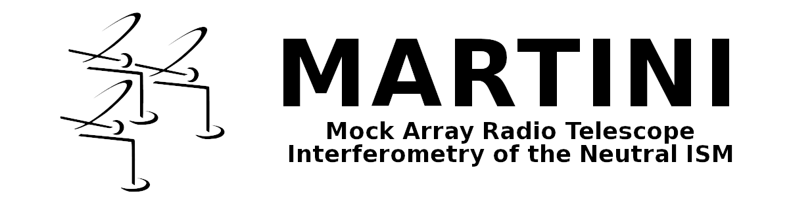

	   
Overview	   
========

MARTINI is a modular package for the creation of synthetic resolved HI line observations (data cubes) of smoothed-particle hydrodynamics simulations of galaxies. The various aspects of the mock-observing process are divided logically into sub-modules handling the data cube, source, beam, noise, spectral model and SPH kernel. MARTINI is object-oriented: each sub-module provides a class (or classes) which can be configured as desired. For most sub-modules, base classes are provided to allow for straightforward customization. Instances of each sub-module class are then given as parameters to the Martini class. A mock observation is then constructed by calling a handful of functions to execute the desired steps in the mock-observing process.

The package is functional and (an old version) has been used in this paper_. Stable releases are available via PyPI (``pip install astromartini``) and the numbered branches on github. The github master branch is under active development: things will change, bugs will happen. Any feedback is greatly appreciated.

.. _paper: https://ui.adsabs.harvard.edu/#abs/2019MNRAS.482..821O/abstract

See the help for martini.Martini_ for an example script to configure MARTINI and create a datacube. This example can be run by doing::
  
  python -c "from martini import demo; demo()"

.. _martini.Martini: https://kyleaoman.github.io/martini/build/html/martini.html

If your use of MARTINI leads to a publication, please acknowledge this and link to the github page, ideally specifying the version used (git commit ID or version number). Suport available via koman@astro.rug.nl.

.. _koman@astro.rug.nl: mailto:koman@astro.rug.nl
