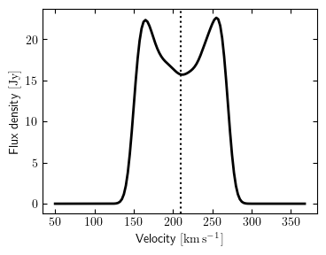

Global profile mode
===================

Sometimes all you want is a spatially-integrated spectrum of a source. The
:class:`~martini.martini.GlobalProfile` class offers a simplified setup of MARTINI for
this purpose.

Assumptions and limitations
---------------------------

In order to offer a simpler and faster way to produce a spectrum, the
:class:`~martini.martini.GlobalProfile` class makes some assumptions:

 - No spatial aperture is assumed. Every particle in the source contributes to the
   spectrum (unless it falls outside of the spectral bandwidth).
 - The positions of particles are still used to calculate the line-of-sight vector and the
   velocity along this direction.

There is therefore no need or way to specify a beam or SPH kernel as with the main
:class:`~martini.martini.Martini` class. It is also not possible to use MARTINI's noise
modules with this class. If these restrictions are found to be too limiting, the best
course of action is to produce a spatially-resolved mock observation and derive the
spectrum from those data as would be done with "real" observations. For example, if the
spectrum within a spatial mask defined by a signal-to-noise or other cut is desired, or if
spatially-dependent effects like primary beam attenuation are relevant, then the
:class:`~martini.martini.GlobalProfile` class should not be used. The
:class:`~martini.martini.GlobalProfile` class is mainly intended to efficiently provide a
"quick look" at the spectrum, or a reference "ideal" spectrum.

Usage
-----

The :doc:`source </sources/index>` and :doc:`spectral model </spectral_models/index>`
modules should be set up as for a full MARTINI mock observation. The
:doc:`beam </beams/index>`, :doc:`noise </noise/index>` and
:doc:`sph_kernel </sph_kernels/index>` modules are not relevant. The
:doc:`datacube </datacube/index>` module is not used, but a subset of its configuration
options are instead given directly to the :class:`~martini.martini.GlobalProfile`.
Schematically, an example initialisation looks like:

.. code-block:: python

    from martini import GlobalProfile
    from martini.sources import SPHSource
    from martini.spectral_models import GaussianSpectrum

    source = SPHSource(...)
    spectral_model = GaussianSpectrum(...)

    gp = GlobalProfile(
        source=source,
        spectral_model=spectral_model,
        n_channels=64,
        channel_width=10 * U.km * U.s**-1,
        spectral_centre=source.vsys,
    )

The arguments to the other modules are omitted here (replaced with ``...``), check the
documentation pages of each module for details. Here the spectrum will be centred on the
source systemic velocity, but an explicit frequency or Doppler velocity value could be
given instead. The units of the ``channel_width`` argument determines whether the
resulting spectrum will have channels evenly spaced in frequency (if ``channel_width`` has
dimensions of frequency) or velocity (if it has dimensions of speed).

Inserting the source
--------------------

The spectrum can be accessed through the ``spectrum`` attribute:

.. code-block:: python

    gp.spectrum

If it has not yet been calculated, it will be calculated when accessed. The calculation
can be explicitly forced with:

.. code-block:: python

    gp.insert_source_in_spectrum()

but this is not usually necessary. In addition to the spectrum itself, the centres and
edges of the channels are available as:

.. code-block:: python

    gp.channel_mids
    gp.channel_edges

respectively. These arrays will have dimensions of frequency or velocity depending on the
units of the ``channel_width`` argument passed to :class:`~martini.martini.GlobalProfile`
on initialization. You can obtain the channel edges or centres in your preferred
dimensions with:

.. code-block:: python

    gp.frequency_channel_mids
    gp.frequency_channel_edges
    gp.velocity_channel_mids
    gp.velocity_channel_edges

Parallelization
+++++++++++++++

The core loop in the source insertion function is a loop over pixels. Since
parallelization is implemented for this loop, and for a
:class:`~martini.martini.GlobalProfile` there is a single pixel, parallelization is not
available in this mode.

Quick plot of the spectrum
--------------------------

As a convenience, a function is provided to make a quick plot showing the spectrum.
Whether the systemic velocity of the source (as reported by ``source.vsys``) is shown by a
vertical dotted line is controlled by the ``show_vsys`` argument. The ``channels``
argument (either ``"velocity"`` or ``"frequency"``) determines the units of the spectral
axis in the figure.

.. code-block:: python

    from martini import demo_source, GlobalProfile
    from martini.spectral_models import GaussianSpectrum

    source = demo_source(N=20000)  # create a simple disc with 20000 particles
    gp = GlobalProfile(
        source=source,
        spectral_model=GaussianSpectrum(sigma=7 * U.km * U.s**-1),
        n_channels=128,
        channel_width=2.5 * U.km * U.s**-1,
        spectral_centre=source.vsys,
        channels="velocity",
    )
    gp.plot_spectrum(
        show_vsys=True,
    )

The resulting figure is returned by the function, or can be directly saved to file with
the ``save`` argument (e.g. ``save="myplot.png"`` or ``save="myplot.pdf"``). This example
looks like:

