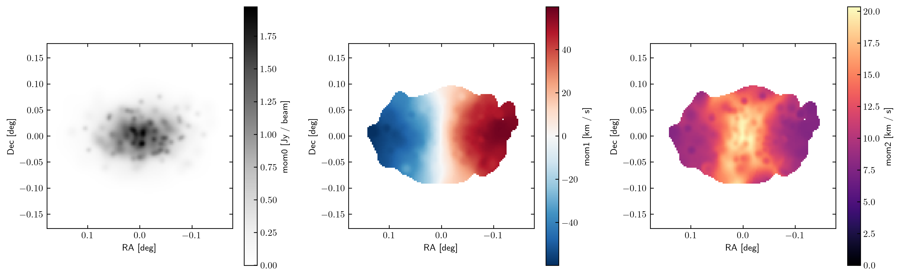

Using MARTINI's HDF5 output
===========================

MARTINI offers an option to output mock observation data cubes in `HDF5`_ format. Below is
an example illustrating reading the output and making a plot of the first three moments of
a data cube.

.. note::

    This example script requires MARTINI v2.1.3 or newer.

.. _HDF5: https://www.hdfgroup.org/solutions/hdf5/

.. code-block:: python

    import h5py
    import numpy as np
    import matplotlib.pyplot as plt
    from astropy import units as U
    from martini import demo

    hdf5file = "testcube.hdf5"
    demo(hdf5file=hdf5file)
    with h5py.File(hdf5file, "r") as f:
        flux_cube = f["FluxCube"][()] * U.Unit(f["FluxCube"].attrs["FluxCubeUnit"])
        ra_vertices = f["RA_vertices"][()] * U.Unit(f["RA_vertices"].attrs["Unit"])
        dec_vertices = f["Dec_vertices"][()] * U.Unit(f["RA_vertices"].attrs["Unit"])
        spec_vertices = f["channel_vertices"][()] * U.Unit(
            f["channel_vertices"].attrs["Unit"]
        )
        vch = (
            f["velocity_channel_mids"][()]
            * U.Unit(f["velocity_channel_mids"].attrs["Unit"])
            - 210 * U.km / U.s  # subtract systemic velocity here
        )

    # if the RA range straddles RA=0 it's easier to plot on a -180<RA<180 range:
    ra_vertices = np.where(
        ra_vertices > 180 * U.deg, ra_vertices - 360 * U.deg, ra_vertices
    )

    # choose units for plotting, not necessarily the units data are stored in:
    ra_unit = U.deg
    dec_unit = U.deg
    mom0_unit = U.Jy / U.beam
    mom1_unit = U.km / U.s
    mom2_unit = U.km / U.s

    fig = plt.figure(figsize=(16, 5))
    sp1 = fig.add_subplot(1, 3, 1, aspect="equal")
    sp2 = fig.add_subplot(1, 3, 2, aspect="equal")
    sp3 = fig.add_subplot(1, 3, 3, aspect="equal")

    # estimate RMS noise in the cube, in this case from a corner patch with little signal:
    rms = np.std(flux_cube[:16, :16])

    # simple 3D source mask by clipping above the noise:
    clip = np.where(flux_cube > 5 * rms, 1, 0)

    mom0 = np.sum(flux_cube, axis=-1)

    # mask for higher moments to focus on high-density regions:
    mask = np.where(mom0 > 0.05 * U.Jy / U.beam, 1, np.nan)

    mom1 = np.sum(flux_cube * clip * vch, axis=-1) / mom0
    mom2 = np.sqrt(
        np.sum(flux_cube * clip * np.power(vch - mom1[..., np.newaxis], 2), axis=-1)
        / mom0
    )
    im1 = sp1.pcolormesh(
        ra_vertices[..., 0].to_value(
            ra_unit
        ),  # pick one channel in ra_vertices, coordinates are the same in all of them
        dec_vertices[..., 0].to_value(
            dec_unit
        ),  # pick one channel in dec_vertices, coordinates are the same in all of them
        mom0.to_value(mom0_unit),
        cmap="Greys",
    )
    plt.colorbar(im1, ax=sp1, label=f"mom0 [{mom0_unit}]")
    im2 = sp2.pcolormesh(
        ra_vertices[..., 0].to_value(
            ra_unit
        ),  # pick one channel in ra_vertices, coordinates are the same in all of them
        dec_vertices[..., 0].to_value(
            dec_unit
        ),  # pick one channel in dec_vertices, coordinates are the same in all of them
        (mom1 * mask).to_value(mom1_unit),
        cmap="RdBu_r",
        vmin=-np.nanmax(np.abs(mom1 * mask)).to_value(mom1_unit),
        vmax=np.nanmax(np.abs(mom1 * mask)).to_value(mom1_unit),
    )
    plt.colorbar(im2, ax=sp2, label=f"mom1 [{mom1_unit}]")
    im3 = sp3.pcolormesh(
        ra_vertices[..., 0].to_value(
            ra_unit
        ),  # pick one channel in ra_vertices, coordinates are the same in all of them
        dec_vertices[..., 0].to_value(
            dec_unit
        ),  # pick one channel in dec_vertices, coordinates are the same in all of them
        (mom2 * mask).to_value(mom2_unit),
        cmap="magma",
        vmin=0,
    )
    plt.colorbar(im3, ax=sp3, label=f"mom2 [{mom2_unit}]")
    for sp in sp1, sp2, sp3:
        sp.set_xlabel(f"RA [{ra_unit}]")
        sp.set_ylabel(f"Dec [{dec_unit}]")
        sp.set_xlim(sp.get_xlim()[::-1])

    plt.subplots_adjust(wspace=0.3)
    plt.show()

This produces the figure:

          (velocity dispersion map) of the demo data cube.
