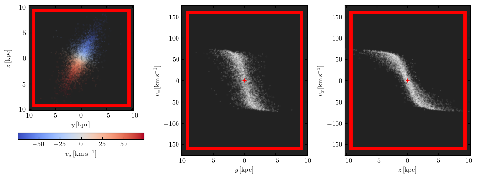
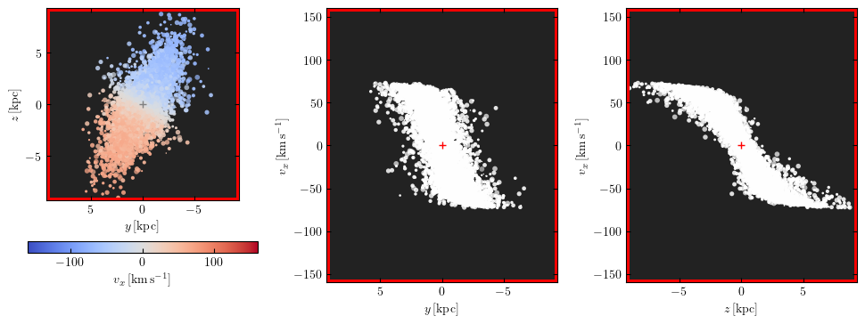

Martini: core routines
======================

The :class:`~martini.martini.Martini` class is the central element of MARTINI.

Putting it all together
-----------------------

Once all of the component modules are set up, creating an instance of
:class:`~martini.martini.Martini` is straightforward, looking something like this:

.. code-block:: python

    source = SPHSource(...)
    datacube = DataCube(...)
    beam = GaussianBeam(...)
    noise = GaussianNoise(...)
    sph_kernel = GaussianKernel(...)
    spectral_model = GaussianSpectrum(...)

    m = Martini(
        source=source,
        datacube=datacube,
        beam=beam,
        noise=noise,
        sph_kernel=sph_kernel,
        spectral_model=spectral_model,
    )

The arguments to the various modules are omitted here (replaced with ``...``), check the
documentation pages of each module for details. The ``source``, ``datacube``,
``sph_kernel`` and ``spectral_model`` arguments are mandatory. The ``beam`` is optional in
case you want an "intrinsic" observation of the source without convolution with a beam,
and the ``noise`` is also optional in case you don't want any in your mock observation (or
perhaps want to later insert your mock into an observed noise cube). There is one more
optional argument ``quiet`` (defaulting to ``False``) that can be switched on for batch
jobs where you don't want any log messages.

A few things happen behind the scenes when the :class:`~martini.martini.Martini` object is
initialized:

 - First, if you provided a beam, your :class:`~martini.datacube.DataCube` instance is
   padded in preparation for convolution with the beam. This is because a beam centred
   near the edge of the region of interest will pick up flux from outside of it, so
   MARTINI needs to fill a buffer region. This padding will be removed after convolution,
   or before any output files are written, but you may notice that your datacube doesn't
   have the shape that you expect if you inspect it closely in the interim.
 - Second, the source is moved to its orientation and location in the "sky" through a
   series of rotations and translations (in both position and velocity). The source
   modules allow for some inspection of the particles before making a mock observation
   (see source module documentation pages). This is almost always best done before passing
   the source to :class:`~martini.martini.Martini`.
 - Next, the source is checked for particles that are guaranteed not to contribute to the
   datacube because they have no overlap with it in position (including their smoothing
   kernel and the padding region) and/or velocity (including spectral broadening). This
   speeds up later calculations, but you may notice that some particles have disappeared
   from your source object.

Mock observation preview
++++++++++++++++++++++++

Similar to the preview functionality of the :doc:`source module </sources/index>`, the
:class:`~martini.martini.Martini` object has a preview function, but with the added
feature that it can obtain information from the :class:`~martini.datacube.DataCube` member
to draw the boundaries of the observation. The following example sets up a
:class:`~martini.martini.Martini` instance similar to the one used in MARTINI's
:func:`~martini._demo.demo` and generates a preview figure.

.. code-block:: python

    import numpy as np
    from scipy.spatial.transform import Rotation
    import astropy.units as U
    from martini import demo_source, DataCube, Martini
    from martini.beams import GaussianBeam
    from martini.noise import GaussianNoise
    from martini.spectral_models import GaussianSpectrum
    from martini.sph_kernels import CubicSplineKernel

    source = demo_source(N=20000)  # create simple disc with 20000 particles
    # a random rotation matrix:
    rotmat = np.array(
        [
            [-0.20808178, -0.97804544, -0.01136216],
            [0.02991471, -0.01797457, 0.99939083],
            [0.97765387, -0.20761513, -0.03299812],
        ]
    )
    # apply it so that the source has no particular orientation:
    source.rotate(Rotation.from_matrix(rotmat))

    datacube = DataCube(
        n_px_x=128,
        n_px_y=128,
        n_channels=32,
        px_size=10.0 * U.arcsec,
        channel_width=10.0 * U.km * U.s**-1,
        spectral_centre=source.vsys,
    )

    beam = GaussianBeam(
        bmaj=30.0 * U.arcsec, bmin=30.0 * U.arcsec, bpa=0.0 * U.deg, truncate=4.0
    )

    noise = GaussianNoise(rms=3.0e-5 * U.Jy * U.beam**-1)

    spectral_model = GaussianSpectrum(sigma=7 * U.km * U.s**-1)

    sph_kernel = CubicSplineKernel()

    m = Martini(
        source=source,
        datacube=datacube,
        beam=beam,
        noise=noise,
        spectral_model=spectral_model,
        sph_kernel=sph_kernel,
    )

    m.preview(fig=1)  # uses matplotlib `plt.figure(1)`

          extent overlaid.

The red box marks the extent of the datacube in right ascension, declination and velocity.
The axes limits can also be set to be equal to these extents by setting the keyword
arguments ``lim="datacube"`` and ``vlim="datacube"``:

.. code-block:: python

    m.preview(fig=2, lim="datacube", vlim="datacube")

          to datacube extent.

Check the :doc:`source module documentation </sources/index>` for further usage examples.
Analogous usage works with the :class:`~martini.martini.Martini`
:func:`~martini.martini.Martini.preview` function (except that the extent of the data cube
will be overlaid).

Inserting the source
--------------------

This is the crucial step in creating a mock observation - the flux from the simulation
particles needs to be added into the data cube. Since everything is already set up, all
that needs to be done is to call :meth:`martini.martini.Martini.insert_source_in_cube`:

.. code-block:: python

    m.insert_source_in_cube()

There is an optional argument ``skip_validation``. Setting this to ``True`` disables
internal accuracy checks and is only intended for experimentation/prototyping and code
development; it should never be used for science (and anyway doesn't have any benefit in
terms of e.g. speed).

Memory management
+++++++++++++++++

:mod:`martini` is a memory-intensive package. New in ``v3``, the main source insertion is
much faster and can automatically split the job into pieces to keep memory usage below a
desired threshold. You can set the threshold with:

.. code-block:: python

    m.insert_source_in_cube(mem_lim_GB=4.0)

The default is 4GB which should avoid running out of memory on most modern systems. It is
recommended to set this as high as possible given the hardware memory available. The code
will then estimate its memory usage to process all particles in a single batch and if this
exceeds the requested limit will break the process into parts that fit within the limit.
This is less efficient than processing all particles in a single batch, but only slightly,
and will barely be noticeable if :mod:`numba` is installed (see below) and 4-8 threads are
used.

You can also set the precision of the data cube array (see ``cube_dtype`` in
:class:`~martini.datacube.DataCube`) and arrays used to store particle spectra (see
``spec_dtype`` in :mod:`~martini.spectral_models`). These default to double-precision
(``np.float64``). Setting them to single-precision (``np.float32``) instead will reduce
the memory footprint of these and several intermediate arrays used internally by a factor
of ``2``. Consider adjusting these settings if single-precision is sufficient and memory
is tight.

Acceleration and parallelization
++++++++++++++++++++++++++++++++

New in ``v3``, many of the core routines are now implemented with :mod:`numba`
"just-in-time" compiled code. It is strongly recommended to install :mod:`numba`.
:mod:`martini` will still function without :mod:`numba` acceleration but will be
a factor of several slower. If you do not have :mod:`numba` installed, the code will
produce a warning to remind you.

In addition to being "accelerated" with :mod:`numba`, several critical segments also
support multi-threaded execution. Using multiple threads can be enabled with:

.. code-block:: python

    m.insert_source_in_cube(ncpu=2)  # or more

However, consider the following before turning up the thread count. Currently
multi-threaded operations include:

 - Evaluating the spectra of the particles. With :mod:`numba` acceleration, using multiple
   threads usually leads to a negligible speedup. This is because the calculation is
   already so fast that CPU throughput is not the limiting factor (probably e.g. memory
   bandwidth). Multiple threads might speed up the process for very large numbers of
   particles (millions+) processed in a single batch, but most machines will not have
   enough memory (likely 1TB or more) to support this.
 - Querying a :class:`~scipy.spatial.KDTree` to find intersections between particle
   smoothing kernels and pixels. Usually this is also not CPU-limited and speedups are
   limited despite multi-thread compatibility.
 - Applying the kernel weights to the spectra for each pixel and writing the result to the
   data cube. This operation does speed up significantly with additional threads, however
   it is normally not the bottleneck overall so speeding up this process makes little
   difference overall.

In summary there is usually little benefit to using more threads, but it also does not do
any harm. If many data cubes need to be created, running several instances of
:mod:`martini` is a better approach than trying to leverage multi-threading, but keep in
mind that :mod:`martini` is most efficient when it has enough memory to avoid
batch-processing particles. Memory demands will usually be the limiting factor for how
many data cubes can be created simultaenously. If there are unused CPU cores that can
be used for multi-threading then setting ``ncpu`` as high as ``8`` is reasonable, going
beyond this is probably pointless.

Adding noise
------------

If you passed a noise module instance to :class:`~martini.martini.Martini`, this is the
time to use it, after inserting the source into the cube. Simply call
:meth:`~martini.martini.Martini.add_noise`:

.. code-block:: python

    m.add_noise()

This function has no required or optional parameters, so that's all there is to it. Adding
the noise should normally be done before convolving with the beam.

Convolving the beam
-------------------

Since providing a beam is optional, so is actually performing the convolution operation.
Assuming that this is a desired step, all that's needed is to call
:meth:`~martini.martini.Martini.convolve_beam`:

.. code-block:: python

    m.convolve_beam()

This one is simple, with no parameters required or optional. You may notice that the
datacube's units change from something like :math:`\mathrm{Jy}\,\mathrm{arcsec}^2` to
:math:`\mathrm{Jy}\,\mathrm{beam}^{-1}` during this step. The padding region explained
above is also discarded here.

All done!
---------

Your mock observation is now complete! You probably want to write the output to a file -
use :meth:`~martini.martini.Martini.write_fits` or
:meth:`~martini.martini.Martini.write_hdf5` according to your preferred output format. If
you want to save a beam image you can use :meth:`~martini.martini.Martini.write_beam_fits`
(the beam image is included automatically in hdf5-format output).

Extra utilities
+++++++++++++++

If for some reason you want to reset the :class:`~martini.datacube.DataCube` to its state
when :class:`~martini.martini.Martini` was initialized, you can use the
:meth:`~martini.martini.Martini.reset` function. It's also possible to dump the datacube
to a cache file with :meth:`~martini.datacube.DataCube.save_state` and later recover it
with :meth:`~martini.datacube.DataCube.load_state`. This might be useful if you want to
avoid repeating an expensive :meth:`~martini.martini.Martini.insert_source_in_cube` call.
