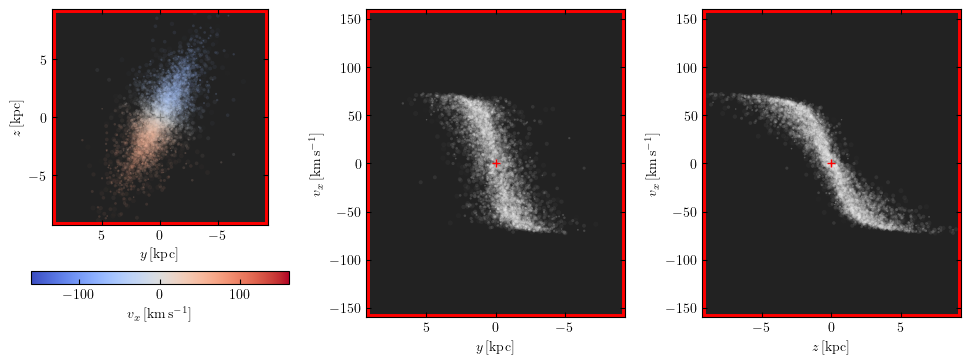

Martini: core routines
======================

The :class:`~martini.martini.Martini` class is the central element of MARTINI.

Putting it all together
-----------------------

Once all of the component modules are set up, creating an instance of
:class:`~martini.martini.Martini` is straightforward, looking something like this:

.. code-block:: python

    source = SPHSource(...)
    datacube = DataCube(...)
    beam = GaussianBeam(...)
    noise = GaussianNoise(...)
    sph_kernel = GaussianKernel(...)
    spectral_model = GaussianSpectrum(...)

    m = Martini(
        source=source,
        datacube=datacube,
        beam=beam,
        noise=noise,
        sph_kernel=sph_kernel,
        spectral_model=spectral_model,
    )

The arguments to the various modules are omitted here (replaced with ``...``), check the
documentation pages of each module for details. The ``source``, ``datacube``,
``sph_kernel`` and ``spectral_model`` arguments are mandatory. The ``beam`` is optional in
case you want an "intrinsic" observation of the source without convolution with a beam,
and the ``noise`` is also optional in case you don't want any in your mock observation (or
perhaps want to later insert your mock into an observed noise cube). There is one more
optional argument ``quiet`` (defaulting to ``False``) that can be switched on for batch
jobs where you don't want any log messages.

A few things happen behind the scenes when the :class:`~martini.martini.Martini` object is
initialized:

 - First, if you provided a beam, your :class:`~martini.datacube.DataCube` instance is
   padded in preparation for convolution with the beam. This is because a beam centred
   near the edge of the region of interest will pick up flux from outside of it, so
   MARTINI needs to fill a buffer region. This padding will be removed after convolution,
   or before any output files are written, but you may notice that your datacube doesn't
   have the shape that you expect if you inspect it closely in the interim.
 - Second, the source is moved to its orientation and location in the "sky" through a
   series of rotations and translations (in both position and velocity). The source
   modules allow for some inspection of the particles before making a mock observation
   (see source module documentation pages). This is almost always best done before passing
   the source to :class:`~martini.martini.Martini`.
 - Next, the source is checked for particles that are guaranteed not to contribute to the
   datacube because they have no overlap with it in position (including their smoothing
   kernel and the padding region) and/or velocity (including spectral broadening). This
   speeds up later calculations, but you may notice that some particles have disappeared
   from your source object.

Mock observation preview
++++++++++++++++++++++++

Similar to the preview functionality of the :doc:`source module </sources/index>`, the
:class:`~martini.martini.Martini` object has a preview function, but with the added
feature that it can obtain information from the :class:`~martini.datacube.DataCube` member
to draw the boundaries of the observation. The following example sets up a
:class:`~martini.martini.Martini` instance similar to the one used in MARTINI's
:func:`~martini._demo.demo` and generates a preview figure.

.. code-block:: python

    import numpy as np
    import astropy.units as U
    from martini import demo_source, DataCube, Martini
    from martini.beams import GaussianBeam
    from martini.noise import GaussianNoise
    from martini.spectral_models import GaussianSpectrum
    from martini.sph_kernels import CubicSplineKernel

    source = demo_source(N=20000)  # create simple disc with 20000 particles
    # a random rotation matrix:
    rotmat = np.array(
        [
            [-0.20808178, -0.97804544, -0.01136216],
            [0.02991471, -0.01797457, 0.99939083],
            [0.97765387, -0.20761513, -0.03299812],
        ]
    )
    # apply it so that the source has no particular orientation:
    source.rotate(rotmat=rotmat)

    datacube = DataCube(
        n_px_x=128,
        n_px_y=128,
        n_channels=32,
        px_size=10.0 * U.arcsec,
        channel_width=10.0 * U.km * U.s**-1,
        spectral_centre=source.vsys,
    )

    beam = GaussianBeam(
        bmaj=30.0 * U.arcsec, bmin=30.0 * U.arcsec, bpa=0.0 * U.deg, truncate=4.0
    )

    noise = GaussianNoise(rms=3.0e-5 * U.Jy * U.beam**-1)

    spectral_model = GaussianSpectrum(sigma=7 * U.km * U.s**-1)

    sph_kernel = CubicSplineKernel()

    m = Martini(
        source=source,
        datacube=datacube,
        beam=beam,
        noise=noise,
        spectral_model=spectral_model,
        sph_kernel=sph_kernel,
    )

    m.preview(fig=1)  # uses matplotlib `plt.figure(1)`

          extent overlaid.

The red box marks the extent of the datacube in right ascension, declination and velocity.
The axes limits can also be set to be equal to these extents by setting the keyword
arguments ``lim="datacube"`` and ``vlim="datacube"``:

.. code-block:: python

    m.preview(fig=2, lim="datacube", vlim="datacube")

          to datacube extent.

Check the :doc:`source module documentation </sources/index>` for further usage examples.
Analogous usage works with the :class:`~martini.martini.Martini`
:func:`~martini.martini.Martini.preview` function (except that the extent of the data cube
will be overlaid).

Initializing the spectra
------------------------

Before the source can be inserted into the datacube, the spectra of all (remaining)
particles need to be calculated on the spectral axis grid. For sources with many particles
this can take a bit of time, but the calculation is vectorized and so scales efficiently
to large numbers of particles. By default this calculation happens when
:meth:`~martini.martini.Martini.insert_source_in_cube` is called (see below), but it can
be explicitly triggered earlier by calling :meth:`~martini.martini.Martini.init_spectra`.
After the actual source insertion, this is usually the most computationally expensive
step. For sources with large numbers of particles see
:ref:`the guidance on parallelization <spec-parallel>` for this step.

Inserting the source
--------------------

This is the crucial step in creating a mock observation - the flux from the simulation
particles needs to be added into the data cube. Since everything is already set up, all
that needs to be done is to call :meth:`martini.martini.Martini.insert_source_in_cube`:

.. code-block:: python

    m.insert_source_in_cube()

Since this is the most computationally demanding step in MARTINI, a progress bar is
displayed by default. This can be suppressed by passing the argument ``progressbar=False``
(or enabled with ``progressbar=True`` if :class:`~martini.martini.Martini` was initialized
with ``quiet=True``). There is another optional argument ``skip_validation``. Setting this
to ``True`` disables internal accuracy checks and is only intended for
experimentation/prototyping and code development; it should never be used for science (and
anyway doesn't have any benefit in terms of e.g. speed).

Parallelization
+++++++++++++++

.. note::

   Available since ``v2.0.4``.

The core loop in the source insertion function is "embarassingly parallel". Parallel
execution is implemented using the `multiprocess`_ package. You may need to install this,
for instance ``pip install multiprocess`` to install from PyPI. To make use of the
parallelization simply specify the number of processes to use, for example:

.. _multiprocess: https://pypi.org/project/multiprocess/

.. code-block:: python

    m.insert_source_in_cube(ncpu=2)

Executing with ``N`` processes is almost exactly ``N`` times faster than using a single
process (provided that ``N`` cpus are available and otherwise idle). There is a small
overhead to create processes (usually a second or less per process), usually dwarfed by
the actual calculation by the time parallelization becomes a concern!

Progress bars work in principle in parallel mode, with one bar per process, although the
formatting of the bars seems to occasionally get a bit glitchy.

.. warning::

    ``multiprocess`` is not to be confused with ``multiprocessing`` - it is a fork of that
    package that, amongst other additional features, implements the object serialization
    used to pass data to/from processes with ``dill`` instead of ``pickle``. This allows
    MARTINI's object-oriented elements to be passed to processes. With
    ``multiprocessing``, lots of internal bits would need to be moved to module-level
    global variables/functions, largely defeating the purpose of an object-oriented
    design.

Adding noise
------------

If you passed a noise module instance to :class:`~martini.martini.Martini`, this is the
time to use it, after inserting the source into the cube. Simply call
:meth:`~martini.martini.Martini.add_noise`:

.. code-block:: python

    m.add_noise()

This function has no required or optional parameters, so that's all there is to it. Adding
the noise should normally be done before convolving with the beam.

Convolving the beam
-------------------

Since providing a beam is optional, so is actually performing the convolution operation.
Assuming that this is a desired step, all that's needed is to call
:meth:`~martini.martini.Martini.convolve_beam`:

.. code-block:: python

    m.convolve_beam()

This one is simple, with no parameters required or optional. You may notice that the
datacube's units change from something like :math:`\mathrm{Jy}\,\mathrm{arcsec}^2` to
:math:`\mathrm{Jy}\,\mathrm{beam}^{-1}` during this step. The padding region explained
above is also discarded here.

All done!
---------

Your mock observation is now complete! You probably want to write the output to a file -
use :meth:`~martini.martini.Martini.write_fits` or
:meth:`~martini.martini.Martini.write_hdf5` according to your preferred output format. If
you want to save a beam image you can use :meth:`~martini.martini.Martini.write_beam_fits`
(the beam image is included automatically in hdf5-format output).

Extra utilities
+++++++++++++++

If for some reason you want to reset the :class:`~martini.datacube.DataCube` to its state
when :class:`~martini.martini.Martini` was initialized, you can use the
:meth:`~martini.martini.Martini.reset` function. It's also possible to dump the datacube
to a cache file with :meth:`~martini.datacube.DataCube.save_state` and later recover it
with :meth:`~martini.datacube.DataCube.load_state`. This might be useful if you want to
avoid repeating an expensive :meth:`~martini.martini.Martini.insert_source_in_cube` call.
