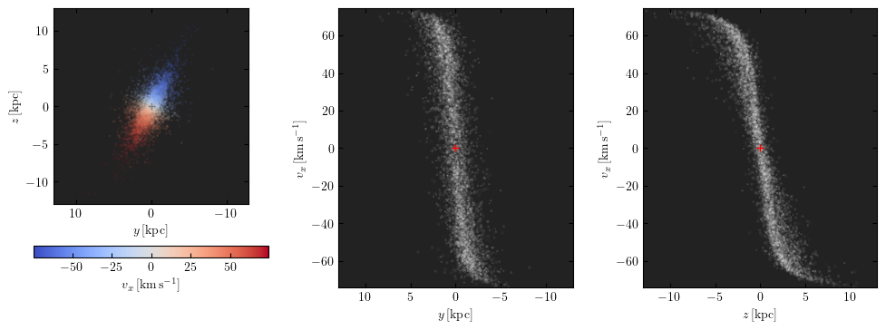
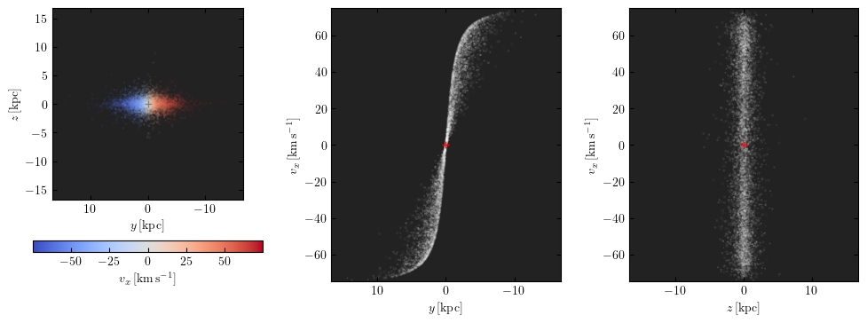
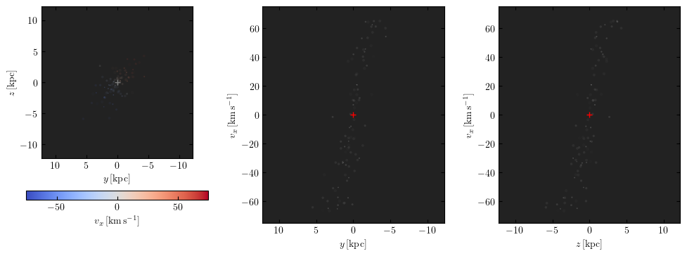
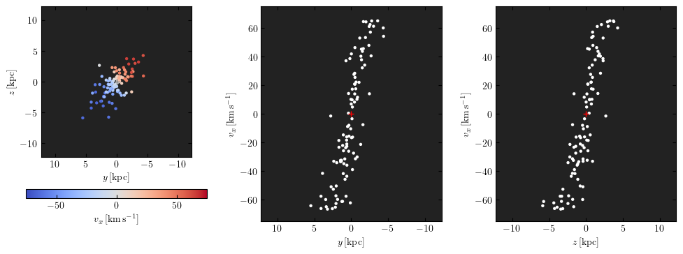
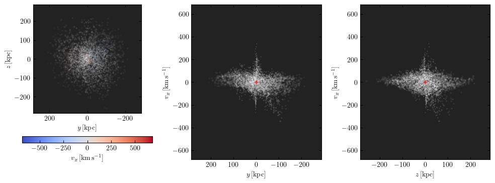
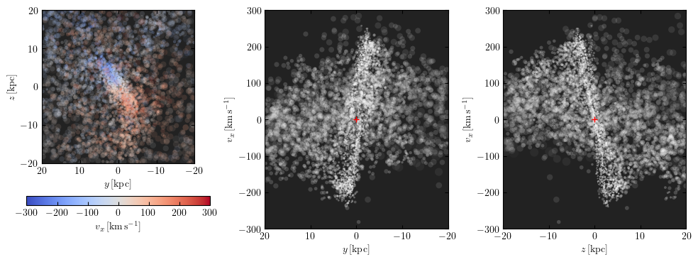

Sources
=======

In the context of mock observations of a simulation, the source is the collection of particles that produce the emission to be "observed".

Sources in MARTINI
------------------

MARTINI has a collection of classes used to store and manipulate the properties of the source particles. All of these inherit from the :class:`martini.sources.sph_source.SPHSource` class. This base class can be created by providing arrays containing the particle coordinates, velocities, masses, etc. The other source classes are tailored to specific simulations or data formats and will typically expect one or more filenames as input, along with an identifier specifying a group of particles (as defined in a group catalogue, for example). These classes will then take care of reading data from the input files, annotating them with units, doing any required calculations or conversions, and so on. There are source classes for the EAGLE_, IllustrisTNG_, Simba_, FIRE_, Colibre and Magneticum_ simulations. The SWIFTGalaxy_ interface to `SWIFT`_-based simulations with a variety of halo catalogue formats is also supported.

.. _EAGLE: https://icc.dur.ac.uk/Eagle
.. _IllustrisTNG: https://www.tng-project.org
.. _Simba: http://simba.roe.ac.uk
.. _FIRE: https://fire.northwestern.edu/
.. _Magneticum: http://www.magneticum.org/
.. _SWIFTGalaxy: https://github.com/SWIFTSIM/swiftgalaxy
.. _SWIFT: https://github.com/SWIFTSIM/SWIFT

Units in MARTINI
----------------

MARTINI adopts the astropy_ system of :mod:`astropy.units`. A very brief introduction is given here for users unfamiliar with this module.

.. _astropy: https://www.astropy.org

The most common unit operation in MARTINI is to attach units to scalars or arrays. This is intuitively achieved by multiplying (or dividing) the scalar/array by the unit. Units can also be raised to powers.

.. code-block :: python

    import numpy as np
    import astropy.units as U
    
    mass = 1 * U.Msun
    speeds = np.array([1000, 1001, 1002]) * U.km / U.s
    density = 1 * U.Msun / U.kpc ** 3

These :class:`astropy.units.Quantity` objects can be used in most of the same ways as ordinary scalars or arrays, but will check unit consistency and/or propagate units during calculations. For example, attempting to add two quantities with incompatible dimensions will raise an exception, and dividing a quantity with dimensions of length by a quantity with dimensions of time will return a quantity with dimensions of speed. Conversion to different units with the same dimensions can be achieved with the :meth:`~astropy.units.Quantity.to` method, while the :meth:`~astropy.units.Quantity.to_value` method will return the (array or scalar) value in the specified units, without units attached.

.. code-block :: python

    from astropy.units import UnitConversionError

    speeds.to(U.Mpc / U.Gyr)  # returns a Quantity object
    (mass * speeds).to_value(U.kg * U.m / U.s)  # returns a numpy array of momenta in SI units
    try:
        mass + density  # incompatible units raise exception!
    except UnitConversionError:
        pass

MARTINI functions that expect :class:`~astropy.units.Quantity` inputs accept any units with the correct dimensions, so a mass could be specified in kg, Msun, or other mass units. Any required unit conversions will then happen internally.

The module :mod:`astropy.constants` provides a wide range of pre-defined physical constants compatible with :mod:`astropy.units`.

Using MARTINI's source classes
------------------------------

The source module contains the simulation particle data and defines how these should be oriented in space and on the sky to be mock observed. This section details how particle data should be provided (either directly or through one of the simulation-specific classes) and how they can be manipulated and inspected before making the actual mock observation.

Particle arrays
+++++++++++++++

The core information required by the :class:`~martini.sources.sph_source.SPHSource` module is the set of arrays containing the properties of the particles making up the source. These are particle coordinates ``xyz_g``, velocities ``vxyz_g``, HI masses ``mHI_g``, smoothing lengths ``hsm_g`` and temperatures ``T_g``. All of these require units attached (see above).

The position of the source is defined by the `(0, 0, 0)` coordinate location. The `y` axis corresponds to right ascension and the `z` azis to declination, such that a particle at `z=0` will be placed at the nominal right ascension of the source (see below), and a particle at `y=0` at its nominal declination. Particles offset from the centre will correspondingly be offset in angle from the centre RA and Dec according to their offsets in `y` and `z` at the distance of the particles. The line of sight toward the centre of the source is along the `x`-axis, so loosely speaking the x-component of the particle velocities determines the channels in which they contribute flux. A particle at the centre of the source with zero velocity in the `x` direction will contribute flux in the channel corresponding to the systemic velocity of the source. More accurately, MARTINI implements a full perspective projection (in contrast to a parallel projection) and accounts for the 3D structure of the source. This means that the "observer" could even be placed *inside* a galaxy to simulate Galactic observations, yielding accurate results within the limitations of the resolution of the simulation. Users can rotate/translate particle coordinates to obtain the desired viewing angle to their source before passing the arrays to the source module, however the source module also offers features to manipulate the source orientation and visualise previews of the mock observation. These are explained below.

The HI masses and temperatures of the particles are straightforward to understand. Both are often tabulated directly in simulation snapshots. If temperature is not present, usually a related quantity such as internal energy is, from which the temperatures can be calculated. If HI masses are not available, calculating neutral hydrogen fractions and partitioning the neutral hydrogen into its atomic and molecular phases may be necessary. How best to do this depends on the details of individual simulations. More information is best sought from relevant publications, the documentation of the simulations in question, or the teams that developed the simulations. For simulations with a corresponding source module in MARTINI, any calculations needed to obtain temperatures and HI masses are implemented in the code.

The smoothing lengths are defined as the full width at half-maximum (FWHM) of the SPH kernel function. Because there is no standard convention for defining smoothing lengths, this is usually not equal to the smoothing lengths tabulated in snapshots. Users need to convert the smoothing lengths from their simulation to the equivalent FWHM before passing them to MARTINI. Further details are in the :doc:`SPH kernels </sph_kernels/index>` section of the documentation. Again, for simulations supported with MARTINI source modules, any conversion of smoothing lengths is handled internally.

Simulation-specific source modules
++++++++++++++++++++++++++++++++++

MARTINI provides source modules to simplify working with publicly-available simulation data sets. These currently include the :class:`~martini.sources.eagle_source.EAGLESource`, :class:`~martini.sources.tng_source.TNGSource`, :class:`~martini.sources.simba_source.SimbaSource` and :class:`~martini.sources.fire_source.FIRESource`. Example usage including how to obtain publicly available data is provided in a set of `Jupyter notebooks`_.

The Magneticum_ simulations are supported with the :class:`~martini.sources.magneticum_source.MagneticumSource`, however detailed examples are not provided due to the lack of publicly available snapshot data. Interested users can refer to the API documentation of the class.

There is also a :class:`~martini.sources.swiftgalaxy_source.SWIFTGalaxySource` source module for SWIFT_ simulation data in conjunction with Velociraptor_ or Caesar_ halo catalogues; support for `HBT+`_ and/or SOAP_ is also planned. A :class:`~martini.sources.colibre_source.ColibreSource` module exists, but since this galaxy formation model is still under development this is currently experimental functionality.

Finally, there is an :class:`~martini.sources.so_source.SOSource` module that interfaces with the SimObj_ package. That package is no longer maintained, but may facilitate working with some simulations including APOSTLE, C-EAGLE/Hydrangea and Auriga.

.. _Jupyter notebooks: https://github.com/kyleaoman/martini/tree/main/examples
.. _Velociraptor: https://github.com/pelahi/VELOCIraptor-STF
.. _Caesar: https://github.com/dnarayanan/caesar
.. _HBT+: https://github.com/SWIFTSIM/HBTplus
.. _SOAP: https://github.com/SWIFTSIM/SOAP
.. _SimObj: https://github.com/kyleaoman/simobj

Distance, peculiar velocity, right ascension and declination
++++++++++++++++++++++++++++++++++++++++++++++++++++++++++++

Any source module can be configured with the ``distance``, ``vpeculiar``, ``ra`` and ``dec`` keyword arguments. The distance, RA and Dec define the offset of the particles relative to the observer. The source is given a recession velocity that places it in the Hubble flow according to its distance and the Hubble constant :math:`H_0=h(100\,\mathrm{km}\,\mathrm{s}^{-1}\,\mathrm{Mpc}^{-1})`. By default `h=0.7`, but this can be adjusted with the ``h`` keyword argument.

The systemic velocity of the source is defined as the sum of the Hubble and peculiar velocities: :math:`v_\mathrm{sys}=v_\mathrm{Hubble}+v_\mathrm{peculiar}`. A positive peculiar velocity therefore makes the source recede faster than :math:`v_\mathrm{Hubble}=H_0D`, and vice-versa. The source is assigned a nominal systemic velocity accessible as the ``vsys`` attribute, but particle velocities are shifted according to their individual distances (this avoids errors in sources with large extents along the line of sight).

A note on implementation details: the peculiar velocity is (correctly) applied as a constant, parallel shift to particle velocities in the source along the direction to the source centre (as defined by its RA, Dec and distance). The Hubble flow velocity offsets, however, are applied to each particle individually along the radial (not parallel) vectors joining them to the "observer". The nominal systemic velocity of the source (provided as the ``vsys`` attribute of a source object) is therefore not exactly the shift applied to each particle in the source, it is that which would be applied to a particle at exactly the RA, Dec and distance of the source centre. 3D peculiar velocities are not (yet) supported. These would typically have a negligible influence on an output data cube unless the observation subtends a large solid angle or the peculiar velocity is exceptionally large. In these cases the projections of the ``y`` and ``z`` components onto the radial vector to a particle can start to make a significant contribution to its line-of-sight velocity (nominally along the ``x`` axis, but only strictly parallel to it along the axis through the centre of the source). This is, again, because MARTINI uses a full perspective projection, not a parallel projection.

Coordinate frame
++++++++++++++++

The conversion from the Cartesian coordinates of particles in a simulation to RA, Dec and distance is conceptually a straightforward conversion to a spherical coordinate system, but there are many celestial coordinate frames. For many use cases of MARTINI the specific choice of coordinate frame is unimportant, but when working closely with observational data the distinction between frames may become important. By default the :class:`~astropy.coordinates.ICRS` coordinate frame is assumed, which is centred on and at rest with respect to the Solar System barycentre. The source distance is defined from this origin, as is the radial velocity. `Other frames`_ implemented by :mod:`astropy` can be specified as arguments to :class:`~martini.sources.sph_source.SPHSource` or other source modules, e.g. ``SPHSource(..., coordinate_frame=GCRS())``. MARTINI's :class:`~martini.datacube.DataCube` class also defines a coordinate frame. At present using different coordinate frames for the two is in principle possible but not well supported, so using the same for both is recommended.

.. _Other frames: https://docs.astropy.org/en/stable/coordinates/#module-astropy.coordinates.builtin_frames

Manipulating a source before making a mock
------------------------------------------

While particle arrays can be manipulated before passing them to one of MARTINI's source modules, sometimes it may be more convenient to manipulate them using tools provided by the source modules.

Rotation and translation
++++++++++++++++++++++++

MARTINI allows source particles to be rotated on initialization, or later by calling the :meth:`~martini.sources.sph_source.SPHSource.rotate` method. Particles can be translated after initialization with the :meth:`~martini.sources.sph_source.SPHSource.translate` method (for "translations" in velocity use :meth:`~martini.sources.sph_source.SPHSource.boost`).

MARTINI offers three ways of specifying rotations:

 - ``axis_angle`` defines a rotation with a 2-tuple where the first element is one of the strings ``"x"``, ``"y"`` or ``"z"`` and the second element is an angle (with units specified with :mod:`astropy.units`). The position and velocity vectors of each particle are rotated about the specified axis (in the "source frame", not the "observer frame").
 - ``rotmat`` defines a rotation with a 3x3 rotation matrix.
 - ``L_coords`` is offered as a convenience when an (approximate) inclination angle and position angle are desired. This method first identifies the plane perpendicular to the angular momentum of the source (specifically, the angular momentum of the 1/3 of particles closest to the source centre). The source is then rotated to place this plane in the `y-z` plane. There is a degree of freedom (a rotation about the angular momentum vector) here; this is fixed with an arbitrary (but *not* random) choice. The ``L_coords`` specification is then a 2-tuple or a 3-tuple. If a 2-tuple, the first element is the desired inclination angle and the second element controls a rotation arond the pole (applied before the inclination). If a third element is provided, this sets the position angle on the sky (otherwise this defaults to 270 degrees). All of these angles should be specified using :mod:`astropy.units`.

To specify a rotation when initializing the source, the rotation is given as a dictionary passed to the ``rotation`` keyword argument, for example:

.. code-block:: python

    SPHSource(rotation={"axis_angle": ("x", 30 * U.deg)}, ...)  # or "rotmat" or "L_coords"

To specify a rotation for a source already initialized, use the ``axis_angle``, ``rotmat`` or ``L_coords`` keyword arguments as:

.. code-block:: python

    source = SPHSource(...)
    source.rotate(axis_angle=("x", 30 * U.deg))  # or rotmat or L_coords

The current rotation state of a source (relative to the state in which the particles were passed in to MARTINI) can be written out to a file (always as a rotation matrix) using :meth:`~martini.sources.sph_source.SPHSource.save_current_rotation`.

Masking
+++++++

A source can be masked to remove particles, if desired. The method :meth:`~martini.sources.sph_source.SPHSource.apply_mask` enables this. It accepts a boolean array (or other objects that can be used to index numpy arrays).

Inspecting a source before making a mock
----------------------------------------

Creating a high-resolution mock observation can be computationally expensive, so it is useful to be able to view a quick representation of the source to check that it appears as desired before investing the effort of making a full mock observation. The source modules provide the :meth:`~martini.sources.sph_source.SPHSource.preview` to enable this. To illustrate its usage, let's set up a randomly-oriented source using MARTINI's simple "demo" toy model of a disc, and call :meth:`~martini.sources.sph_source.SPHSource.preview`:

.. code-block:: python

    import numpy as np
    import astropy.units as U
    from martini import demo_source

    source = demo_source(N=20000)  # create simple disc with 20000 particles
    # a random rotation matrix:
    rotmat = np.array(
        [
            [-0.20808178, -0.97804544, -0.01136216],
            [0.02991471, -0.01797457, 0.99939083],
            [0.97765387, -0.20761513, -0.03299812],
        ]
    )
    # apply it so that the source has no particular orientation:
    source.rotate(rotmat=rotmat)

    source.preview(fig=1)  # uses matplotlib `plt.figure(1)`

The preview function returns the ``Figure`` object, so this can be captured manipulated, if desired. The resulting preview looks like:

The number of particles plotted is limited to 5000 to avoid excessively large ``Figure`` objects, but this can be controlled with the ``max_points`` keyword argument. The first panel shows the particle positions in the `y-z` plane (which approximately maps to RA and Dec), coloured by the `x`-component of the velocity (which approximately maps to the line-of-sight velocity). The second panel shows the PV diagram of particle along the `y` coordinate direction, and the third panel the same along the `z` coordinate direction. Let's rotate the disc to be edge on and preview it again:

.. code-block:: python

    source.rotate(L_coords=(90 * U.deg, 0 * U.deg))  # (inclination, polar rotation); implicit: PA=270deg
    source.preview(fig=2)

This does look like an edge on disc, and the PV diagrams now correspond to the major (middle panel) and minor (right panel) axis PV diagrams. Let's switch orientations again to 60 degrees inclined and a position angle offset 45 degrees from its previous value of 270 degrees, and this time we'll show only 100 points.

source.rotate(L_coords=(90 * U.deg, 0 * U.deg, 225 * U.deg))
source.preview(max_points=100, fig=3)

This doesn't look great. The preview function tries to adjust the transparency and sizes of the points to qualitatively reflect their HI masses and smoothing lengths, but this may sometimes lead to results that aren't very useful. The points can be forced to a constant size and transparency with ``point_scaling="fixed"``.

.. code-block:: python

    source.preview(max_points=100, fig=4, point_scaling="fixed")

Let's look at a more realistic example from the TNG simulations.

.. code-block:: python

    from martini.sources import TNGSource

    tng_source = TNGSource(
        "TNG50-1",
        99,
        572840,
        api_key="your-tng-api-key-goes-here",
    )
    tng_source.preview(fig=5)

The preview function scales the axes to enclose all particles in the source. In this case we're mostly seeing the hot circumgalactic gas extending out beyond 200 kpc. The ``lim`` keyword argument sets the (absolute value) offset from the centre shown in the preview, and the ``vlim`` keyword argument similarly limits the velocity offset from zero. Note that these keyword arguments have no influence on the particles contained in the source, just on what's visible in the preview. Let's take a guess at the likely size of a disc and see what's there.

.. code-block:: python

    tng_source.preview(fig=6, lim=20 * U.kpc, vlim=300 * U.km / U.s)

Aha, an inclined disc within the hot halo. From here we could continue to adjust the orientation, if desired.

Because the :mod:`~martini.sources.tng_source.TNGSource` module has automatically retrieved and loaded the particle arrays, we did not need to pass them in, and therefore never had a chance to do anything with them, if we desired to. The particle arrays are accessible as attributes, for example:

.. code-block:: python

    tng_source.xyz_g
    tng_source.vxyz_g
    tng_source.mHI_g
    tng_source.T_g
    tng_source.hsm_g

The same attributes exist for all source modules available in MARTINI.
